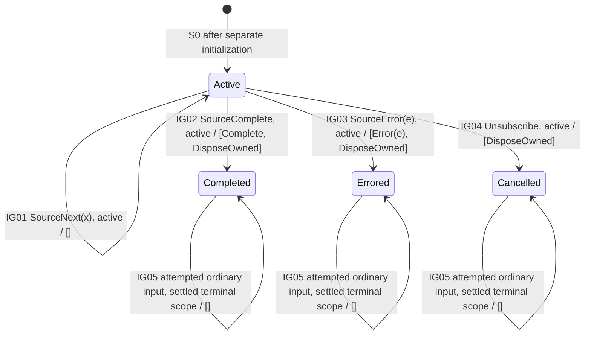

# ignoreElements — Control-State Diagram

> Generated by `npm run generate`; edit the model descriptors or generator, not this file.

[Profile](../operators/ignoreElements.md). This projects state to control phases; any retained index is omitted from the nodes. Edge labels contain the input and guard / G; the target is the control component of T.

DisposeOwned is a resource-control letter, not an Observable notification. Terminal self-loops describe attempted inputs at a settled boundary, not actual continued upstream delivery.
