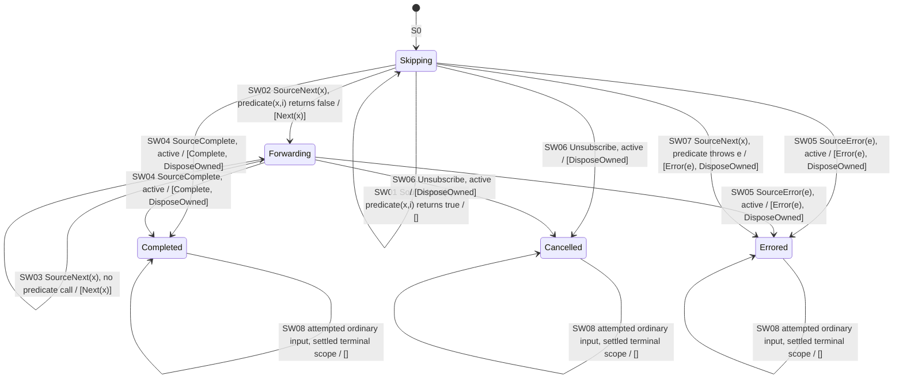

# skipWhile — Control-State Diagram

> Generated by `npm run generate`; edit model descriptors or the generator, not this file.

This projects away counters; it does not enumerate all states. Arrows show input and guard / G, and the target is the control component of T. [Profile](../operators/skipWhile.md).

Terminal self-loops describe attempted ordinary inputs at the settled model boundary, not delivery from a disconnected producer. SubscribeSource and DisposeOwned are resource-control letters, not Observable notifications.
