# takeWhile — State Diagram

> Generated by `npm run generate`. Edit the reviewed descriptors/model, not this file.

This is a **control-state projection**, not enumeration of every index. `Active` represents `Active(i)`. Edge labels are input, guard / G; target nodes represent the control component of T.

```mermaid
stateDiagram-v2
    [*] --> Active: S0 = Active(0)
    Active --> Active: TW01 SourceNext(x), predicate(x,i) returns true / [Next(x)]
    Active --> Completed: TW02 SourceNext(x), predicate returns false; inclusive=false / [Complete, DisposeOwned]
    Active --> Completed: TW03 SourceNext(x), predicate returns false; inclusive=true / [Next(x), Complete, DisposeOwned]
    Active --> Completed: TW04 SourceComplete, always / [Complete, DisposeOwned]
    Active --> Errored: TW05 SourceError(error), always / [Error(error), DisposeOwned]
    Active --> Cancelled: TW06 Unsubscribe, always / [DisposeOwned]
    Active --> Errored: TW07 SourceNext(x), predicate throws error / [Error(error), DisposeOwned]
    Completed --> Completed: TW08 attempted input / []
    Errored --> Errored: TW08 attempted input / []
    Cancelled --> Cancelled: TW08 attempted input / []
```

`DisposeOwned` is a control output, not an Observable notification. The self-loops describe the model's settled terminal boundary; they do not claim that a disconnected source actually delivers later inputs.
